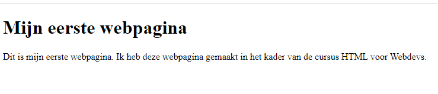

# Maak je eerste webpagina

## Opdracht mappenstructuur

Maak in jouw **Documenten** map een nieuwe map aan met de naam  `Cursus HTML voor Webdevs`. Het is 
de bedoeling dat je tijdens deze cursus alle bestanden die je maakt in deze map en submappen bewaart.

Heb je dus een oefening 1 uit het H1 dan maak je de volgende mappenstructuur aan:

```
Cursus HTML voor Webdevs
└───H1-inleiding
    └───bestanden hier
```

## Opdracht 1

Maak een nieuw bestand aan met de naam `index.html` in de map `H1-inleiding`.

Rechtsklik op het bestand en kies voor **Openen met** en kies voor **openen met Notepad/kladblok**.

Kopieer en kleef de onderstaande tekst in het bestand:

```html

<!DOCTYPE html>
<html lang="nl">
<head>
    <meta charset="UTF-8">
    <title>Mijn eerste webpagina</title>
</head>
<body>
    <h1>Mijn eerste webpagina</h1>
    <p>Dit is mijn eerste webpagina. Ik heb deze webpagina gemaakt in het kader van de cursus HTML voor Webdevs.</p>
</body>
</html>
```

Sla het bestand op en open het bestand in je browser. Je zou nu het volgende moeten zien:



